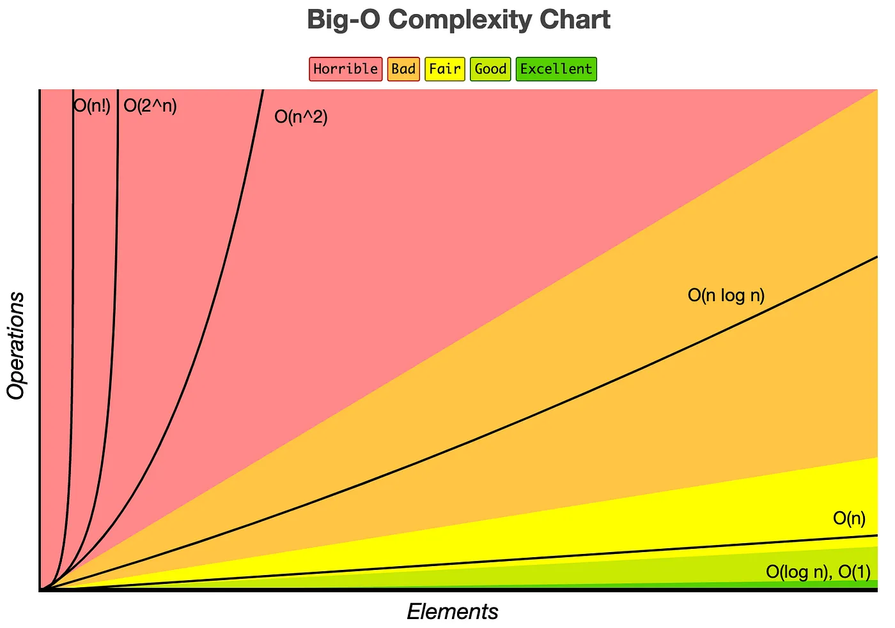

# Big-O notation

Worst case complexity of an algorithm is represented in big-O notation.
Big-O notation describes complexity of algorithm using algebraic terms

It has two important characteristics:
- it is expressed in terms of input
- It focuses on the bigger picture without getting caught up in the minute details

## Asymptotic notations
- Mathematical tools to represent time and space complexity
    - `Big-O` notation (O-notation) - worst case complexity
    - `Omega Notation` (Ω-notation) - best case complexity
    - `Theta Notation` (Θ-notation) - average case complexity

## Supplemental

- https://www.geeksforgeeks.org/what-is-logarithmic-time-complexity/
- https://medium.com/@truongbui95/a-simple-explanation-of-big-o-notation-with-examples-e98b2c2fefa8
- https://www.bigocheatsheet.com/

## TL;DR

- Graph illustrating algorithm performance: https://www.bigocheatsheet.com/

- `O(1)` is `constant time`
- `O(log n)` is `logarithmic time` 
- `O(n)` is `linear time`
- `0(n log n)` is `pseudo-linear time`
- `O(n ^ 2)` is `quadratic time` 
- `O(2 ^ n)` is `exponential time`
- `O(n!)` is `factorial time` 

- good performance
    - `O(1)` `constant time`, regardless of the input the algorithm will execute only once.    
    - `O(log n)` `logarithmic time`. efficient and fast as input size increases, such as binary search. the larger, the more efficient.    
- fair performance
    - `O(n)` `linear time` as input size increases, so does the time complexity also increase.    
- bad performance
    - `O(n log n)` `pseudo-linear time` linear-like behavior, but higher growth rate than linear time complexity.
        - `pseudo-linear` is often a loop within a loop, where the inner loop does not necessarily traverse every node, thus it is 
          a slight improvement over `quadratic time` complexity.
        - many sort and search algorithms as well as graph traversal are pseudo-linear
- poor performance, use caution
    - `O(n^2)` `quadratic time` complexity, this is a loop within a loop.  This is acceptable often, but not optimal.
    - `O(2^n)` `exponential time` complexity, necessary when algorithms must explore all possible permutations (or combinations) of input elements.
    - `O(n!)` `factorial time` complexity.  the number of possibilities grows rapidly with the input size.


## Simple Cheat Sheet

- `O(1)` is `constant time`
- `O(log n)` is `logarithmic time` 
- `O(n)` is `linear time`
- `0(n log n)` is `pseudo-linear time`
- `O(n ^ 2)` is `quadratic time` 
- `O(2 ^ n)` is `exponential time`
- `O(n!)` is `factorial time` 

## Conceptuals:

- loop of input is `O(n)` or `linear time`.
- nested loop of input is `O(n^2)` or `quadratic time`.
- input reduced by half is `O(log n)` or `logarithmic time`.


## Big-O Time Complexity 

```javascript
// sum of first N actual numbers
// this is O(n) as the complexity inceases with the size of the input
function summation(n) {
    let sum = 0;
    for (let i = 1; i <=n; i++) {
        sum += i;
    }
    return sum;
}

// example: 
// summation(4) = 10
// 1+2+3+4 = 10 

// count the number of times a statement executes based on the input size
```

There are 3 statements that execute in the program above:
- `let sum = 0` to allocate memory
- `sum += i` to add, the for loop just signals that this is run several times
- `return sum` executes to return the final value


```javascript
// another way to do summation
// however, this one is more performant
// this is O(1) as there is one calculation only executed. 
// no matter now big n, the calculation only runs once.
function summation(n) {
    return (n * (n +1)) / 2;
}
```

Quadratic is slower

```javascript
// for the size of the input, this algorithm runs twice
// O(n^2) quadratic time complexity
for(i = 1; i <= 10; i++) {
    for(j = 1; j <= 10; j++) {

    }
}
```


## Big-O

Focus on the big picture without being caught up in the minor details.

- `N + 2` can be represented as just `N` because the `+2` is insignificant.


## Dropping less dominant terms

- n+2 is just n in big-O.
- O(n^2 + n + 1) is O(n^2) in big-O.




## Big-O Notations

- A good summary: https://medium.com/@truongbui95/a-simple-explanation-of-big-o-notation-with-examples-e98b2c2fefa8

- good performance
    - `O(1)` `constant time`, regardless of the input the algorithm will execute only once.    
    - `O(log n)` `logarithmic time`. efficient and fast as input size increases, such as binary search. the larger, the more efficient.    
- fair performance
    - `O(n)` `linear time` as input size increases, so does the time complexity also increase.    
- bad performance
    - `O(n log n)` `pseudo-linear time` linear-like behavior, but higher growth rate than linear time complexity.
        - `pseudo-linear` is often a loop within a loop, where the inner loop does not necessarily traverse every node, thus it is 
          a slight improvement over `quadratic time` complexity.
        - many sort and search algorithms as well as graph traversal are pseudo-linear
- poor performance, use caution
    - `O(n^2)` `quadratic time` complexity, this is a loop within a loop.  This is acceptable often, but not optimal.
    - `O(2^n)` `exponential time` complexity, necessary when algorithms must explore all possible permutations (or combinations) of input elements.
    - `O(n!)` `factorial time` complexity.  the number of possibilities grows rapidly with the input size.

## Space Complexity 

- Uses the same Big-O notation as above

Examples:
- `O(1)` constant: might be a sorting algorithm that sorts within the input array, no duplication or additoinal array.
- `O(1)` linear:
- `O(log n)` logarithmic:
- `O(n^2)`

